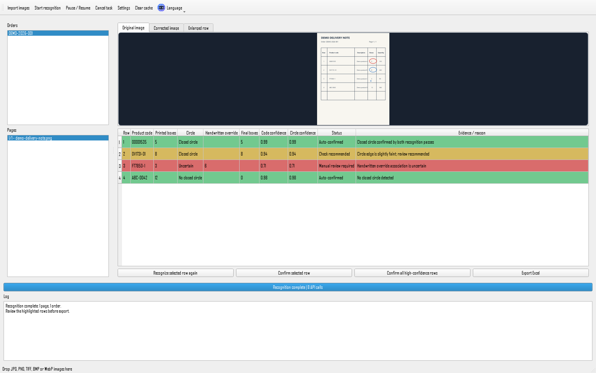
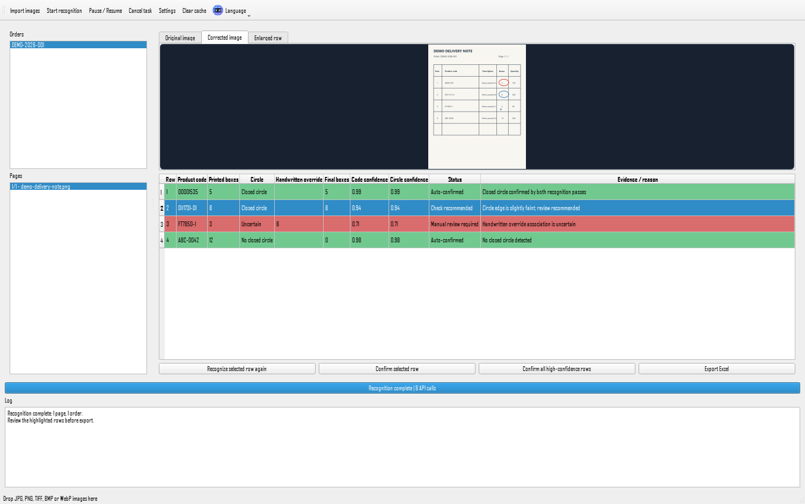
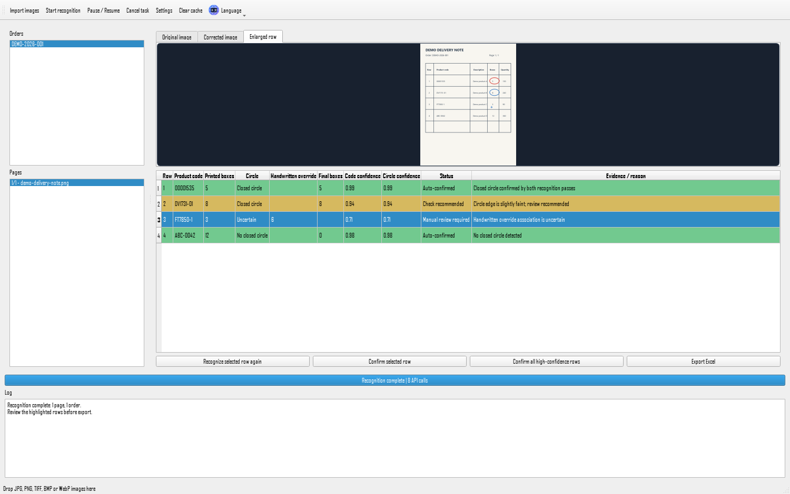
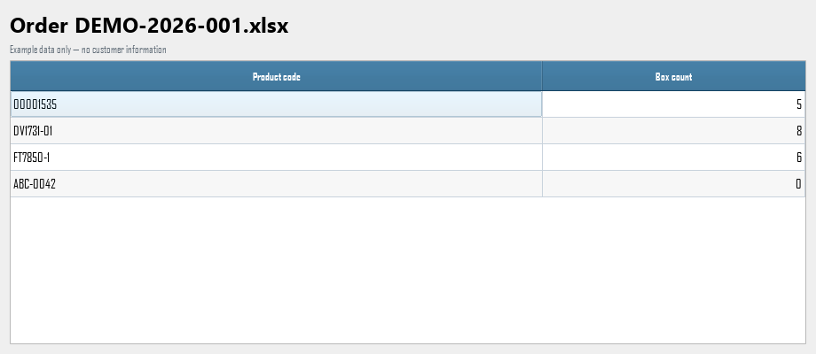

# OrderOCR

OrderOCR is a Windows desktop application that converts photographed delivery notes into reviewed Excel files.

It corrects document images, groups pages by order, extracts product codes and box counts, highlights uncertain results for manual review, and exports one Excel file per order.

The interface supports English, Chinese, and French.

## Screenshot



All screenshots use generated example data. They contain no real customer orders or personal information.

### Recognition and output examples

| Recognition results | Manual review |
| --- | --- |
|  |  |



## Key features

- Import JPG, JPEG, PNG, BMP, TIFF, and WebP document images
- Automatic rotation, document detection, and perspective correction
- OCR-assisted extraction of product rows
- AI-assisted extraction with validated structured results
- Independent verification of handwritten and circled box counts
- Manual review for uncertain values
- Missing-page, duplicate-page, and duplicate-image detection
- Task recovery and recognition caching with SQLite
- Excel export with product codes and final box counts
- Localized interface in English, Chinese, and French
- No advertising, analytics, or tracking SDKs

## Requirements

- Windows 10 or Windows 11
- An internet connection for AI-assisted recognition
- An OpenAI API key with access to a vision-capable model that supports structured outputs
- For source installation: 64-bit Python 3.11, 3.12, or 3.13

## Quick start

### Use the packaged Windows release

1. Open [GitHub Releases](https://github.com/CHANCE31236/OrderOCR/releases).
2. Download `OrderOCR-Windows-x64.zip` from the latest release.
3. Extract the ZIP file to a normal user folder.
4. Run `OrderOCR.exe`.
5. Open Settings and enter your OpenAI API key.

### Run from source

1. Download or clone this repository.
2. Double-click `install.bat` and wait for installation to finish.
3. Double-click `start.bat`.
4. Open Settings and enter your OpenAI API key.

Administrator permissions are not required and are not recommended for normal use.

The API key is stored in Windows Credential Manager. It is not written to ordinary settings files, logs, or source code. As an alternative for local development, copy `.env.example` to `.env` and enter the key there. The `.env` file is ignored by Git.

## How it works

1. Import delivery-note photos.
2. Let OrderOCR correct and analyze each page.
3. Review page grouping and any missing-page warnings.
4. Inspect uncertain product rows and confirm the final box counts.
5. Export one Excel file per order.

The spreadsheet contains only two columns: `Product code` and `Box count`. Product codes are stored as text to preserve leading zeros.

## Box-count rules

The final box count never comes from the total quantity column.

1. A clearly associated non-negative handwritten box override has highest priority.
2. Otherwise, a printed box count inside a clearly closed circle is kept.
3. Otherwise, a confirmed absence of a closed circle produces zero.
4. An uncertain circle blocks automatic export and requires manual review.

Dots, ticks, short strokes, slashes, brackets, and open arcs are not closed circles.

## Privacy

Images are sent only to the configured OpenAI vision API. The application contains no advertising, analytics, or tracking SDKs.

Do not commit `.env`, API keys, real delivery-note photos, audit logs, customer data, or Excel exports. The repository includes an automated secret scan, but users remain responsible for reviewing files before publishing them.

## Limitations

Recognition is not guaranteed to be 100% accurate. Blurry images, damaged page edges, layout changes, character conflicts such as O/0, I/l/1 and S/5, uncertain circles, missing pages, and ambiguous handwriting require manual confirmation.

Substantially different delivery-note layouts may reduce row-crop accuracy. Always review highlighted results before exporting or using them in an operational workflow.

## Technical details

- OpenCV handles orientation scoring, page detection, perspective correction, denoising, and enhancement.
- RapidOCR and ONNX Runtime provide local text and position hints.
- The OpenAI Responses API performs image-based extraction and independent row verification.
- Pydantic validates structured model responses before business rules use them.
- Python business rules recalculate every final box count.
- SQLite stores recovery state, audit events, duplicate hashes, and cached results.
- openpyxl creates the two-column Excel output.
- PySide6 provides the Windows desktop interface.

## Development

Install the development dependencies and run the checks:

```powershell
.\.venv\Scripts\python.exe -m pip install -r requirements-dev.txt
$env:QT_QPA_PLATFORM='offscreen'
.\.venv\Scripts\python.exe scripts\check_no_secrets.py
.\.venv\Scripts\python.exe -m pytest -q
.\.venv\Scripts\python.exe main.py --self-test
```

To regenerate the README screenshots with synthetic data:

```powershell
.\.venv\Scripts\python.exe scripts\generate_readme_screenshots.py
```

## Build

Run `build.bat`. The script installs development dependencies, runs the test suite, builds a one-file executable, copies runtime resources, and creates an English desktop shortcut.

Output:

```text
dist\OrderOCR.exe
```

Version tags matching `v*` trigger the Windows release workflow, which builds and tests `OrderOCR.exe` before publishing a ZIP archive.

## Contributing

Read [CONTRIBUTING.md](CONTRIBUTING.md) before proposing changes. Security-sensitive reports should follow [SECURITY.md](SECURITY.md).

Release history is available in [CHANGELOG.md](CHANGELOG.md) and on the [GitHub Releases](https://github.com/CHANCE31236/OrderOCR/releases) page.

## License

This repository is not currently licensed as open-source software.

No permission is granted to copy, modify, redistribute, or use the code commercially unless explicitly authorized by the repository owner. All rights remain with the repository owner unless a license is added later.
